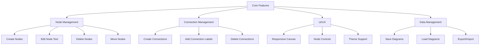
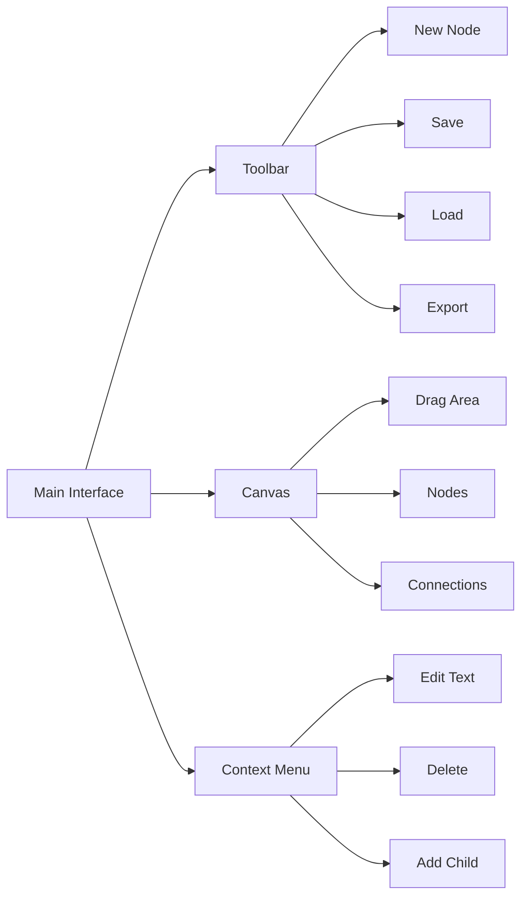
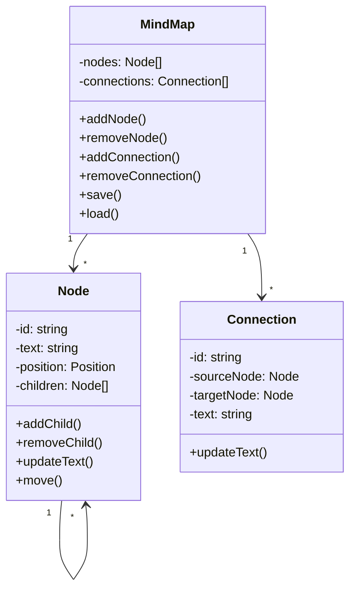

# Mind Mapping Application Plan

## 1. Technical Stack

- Frontend: HTML5, CSS3, JavaScript
- Visualization: SVG for rendering diagrams
- No backend needed initially - will store data in browser localStorage

## 2. Core Features

## 3. User Interface Design

## 4. Technical Architecture

## 5. Implementation Phases

### Phase 1: Core Framework
1. Set up project structure
   - Create HTML, CSS, and JavaScript files
   - Set up SVG canvas
   - Implement basic event handling

2. Implement basic canvas with SVG
   - Create responsive SVG container
   - Add zoom and pan functionality
   - Implement grid system for alignment

3. Create node creation and rendering
   - Implement node creation logic
   - Design node appearance
   - Add basic node interaction

4. Add basic drag-and-drop functionality
   - Implement node dragging
   - Add position snapping
   - Handle collision detection

### Phase 2: Node Management
1. Implement node text editing
   - Create text input interface
   - Handle text updates
   - Implement auto-sizing nodes

2. Add node deletion
   - Create delete functionality
   - Handle child node cleanup
   - Update connections

3. Create "Add Child" functionality
   - Implement plus button UI
   - Handle child node creation
   - Position new child nodes

4. Support orphan nodes
   - Allow independent node creation
   - Implement drag to connect
   - Handle orphan node management

### Phase 3: Connections
1. Implement connection drawing
   - Create SVG path generation
   - Handle curved connections
   - Implement connection routing

2. Add connection text support
   - Create text placement logic
   - Handle text editing
   - Implement text positioning

3. Create connection styling
   - Implement different line styles
   - Add arrow markers
   - Create hover effects

4. Handle connection updates
   - Update during node moves
   - Implement connection repositioning
   - Handle connection intersections

### Phase 4: UI/UX Enhancement
1. Add toolbar with core actions
   - Create toolbar layout
   - Implement action buttons
   - Add keyboard shortcuts

2. Implement context menu
   - Design context menu
   - Add node-specific actions
   - Handle connection actions

3. Create smooth animations
   - Add node movement animations
   - Implement connection updates
   - Create transition effects

4. Add visual feedback
   - Implement hover states
   - Add selection indicators
   - Create action feedback

### Phase 5: Data Management
1. Implement save/load functionality
   - Create data structure
   - Implement localStorage saving
   - Add auto-save feature

2. Add export/import features
   - Create JSON export
   - Implement import validation
   - Add file handling

3. Add undo/redo support
   - Implement action history
   - Create state management
   - Handle complex operations

4. Implement auto-save
   - Add periodic saving
   - Create backup system
   - Handle recovery

## 6. Visual Design Elements

- Modern, clean interface
  - Minimalist design
  - Clear typography
  - Consistent spacing

- Smooth animations
  - Node creation/deletion
  - Connection updates
  - UI interactions

- Clear visual hierarchy
  - Node relationships
  - Selection states
  - Active elements

- Customizable styles
  - Node colors
  - Connection types
  - Text formatting

- Responsive design
  - Mobile support
  - Touch interactions
  - Screen adaptation

## 7. Testing Strategy

### Unit Tests
- Node management functions
  - Creation/deletion
  - Text updates
  - Position handling

- Connection handling
  - Path generation
  - Text placement
  - Update logic

- Data persistence
  - Save/load
  - Import/export
  - State management

### Integration Tests
- Node-connection interactions
  - Drag operations
  - Child creation
  - Connection updates

- UI component integration
  - Toolbar actions
  - Context menu
  - Keyboard shortcuts

- Save/load functionality
  - Data consistency
  - Error handling
  - Recovery

### User Testing
- Usability testing
  - Interaction flows
  - Error handling
  - User feedback

- Performance testing
  - Large diagrams
  - Animation smoothness
  - Memory usage

- Cross-browser compatibility
  - Major browsers
  - Mobile devices
  - Different screen sizes