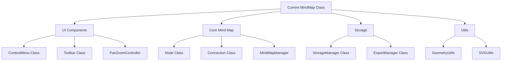

# Mind Map Refactoring Plan

## Current Structure Analysis
The current codebase consists of a single large MindMap class that handles all functionality including:
- UI interactions (event listeners, context menu)
- Node creation and management  
- Connection handling
- Pan/zoom functionality
- Save/load/export operations

## Proposed Architecture



## New File Structure

```
scripts/
├── components/
│   ├── ContextMenu.js
│   ├── Toolbar.js
│   └── PanZoomController.js
├── core/
│   ├── Node.js
│   ├── Connection.js
│   └── MindMapManager.js
├── storage/
│   ├── StorageManager.js
│   └── ExportManager.js
├── utils/
│   ├── GeometryUtils.js
│   └── SVGUtils.js
└── main.js
```

## Component Responsibilities

### Components
- **ContextMenu.js**
  - Handle context menu creation and display
  - Manage menu item actions
  - Control submenu behavior

- **Toolbar.js**
  - Manage toolbar button creation
  - Handle button click events
  - Control toolbar state

- **PanZoomController.js**
  - Handle pan functionality
  - Manage zoom operations
  - Track viewport state

### Core
- **Node.js**
  - Node creation and rendering
  - Node state management
  - Node interaction handling

- **Connection.js**
  - Connection creation and rendering
  - Path calculation
  - Connection label management

- **MindMapManager.js**
  - Orchestrate nodes and connections
  - Manage mind map state
  - Handle high-level operations

### Storage
- **StorageManager.js**
  - Handle save operations
  - Manage load functionality
  - Data serialization/deserialization

- **ExportManager.js**
  - Handle mind map exports
  - Format conversions
  - Export options management

### Utils
- **GeometryUtils.js**
  - Position calculations
  - Angle computations
  - Distance calculations

- **SVGUtils.js**
  - SVG element creation
  - Element attribute management
  - SVG helper functions

### Main Entry Point
- **main.js**
  - Initialize components
  - Wire up dependencies
  - Bootstrap application

## Benefits of Refactoring
1. **Improved Maintainability**
   - Clear separation of concerns
   - Smaller, focused modules
   - Easier to understand and modify

2. **Better Testability**
   - Isolated components
   - Clear dependencies
   - Easier to mock and test

3. **Enhanced Extensibility**
   - Modular design
   - Clear extension points
   - Easier to add features

4. **Reduced Code Duplication**
   - Shared utilities
   - Reusable components
   - DRY principles

5. **Clear Dependencies**
   - Explicit module relationships
   - Better dependency management
   - Easier to understand flow

## Implementation Strategy
1. Create new directory structure
2. Extract utility functions first
3. Create core classes
4. Move UI components
5. Implement storage functionality
6. Update main entry point
7. Add tests for new modules